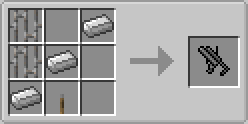
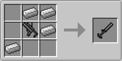
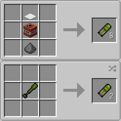
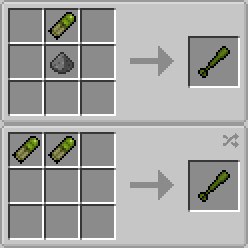

# Type18GrenadeLauncher

Add grenade launchers and their ammunition to Minecraft with Forge.

## Release

- v1.12.2-1.0.0.0

## Description

### Grenade Launchers

#### 40mm Grenade Launcher (40mmてき弾銃)

- Crafting: 2 Iron Bars + 3 Iron Ingots + 1 Lever -> 1 40mm Grenade Launcher
- Ammo: HE 40mm Grenade Cartridge
- Launch: Right Click
- Initial Velocity: 60 m/s
- Rate of Fire: 7.5 rpm

#### 51mm Grenade Discharger (51mmてき弾筒)

- Crafting: 4 Iron Ingots + 1 40mm Grenade Launcher -> 1 51mm Grenade Discharger
- Ammo: HE 51mm Grenade Cartridge
- Launch: Sneak Right Click
- Initial Velocity: 60 m/s
- Rate of Fire: 30 rpm

### Ammo

#### HE 40mm Grenade Cartridge (40mm榴弾)

- Crafting: 1 Heavy Weighted Pressure Plate + 1 TNT + 1 Gunpowder -> 8 HE 40mm Grenade Cartridges
- Crafting: 1 HE 51mm Grenade Cartridge -> 2 HE 40mm Grenade Cartridges
- Kill Radius: 5 m

#### HE 51mm Grenade Cartridge (51mm榴弾)

- Crafting: 1 HE 40mm Grenade Cartridge + 1 Gunpowder -> 1 HE 51mm Grenade Cartridge
- Crafting: 2 HE 40mm Grenade Cartridges -> 1 HE 51mm Grenade Cartridge
- Kill Radius: 10 m

## Configuration

Configuration is saved in `type18grenadelauncher.cfg`.

### common

- **detonateWhenCannotUpdate** (boolean, default is true)
  - Detonate grenade when it cannot be updated by unloaded chunks
- **enableLog** (boolean, default is true)
  - Enable to log grenade's launching and detonating
- **grenadeDamageLevel** (Integer 0–2, default is 1)
  - Set grenade's damage (0: none, 1: entities, 2: terrain and entities)

---
Copyright (c) 2019 Iunius118
