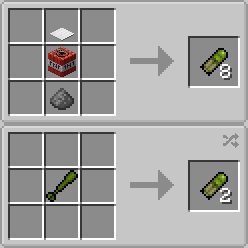

# Type18GrenadeLauncher

Add grenade launchers and their ammunition to Minecraft with Forge.

## Release

- [v1.12.2-1.1.1.0](https://github.com/Iunius118/Type18GrenadeLauncher/releases/tag/v1.12.2-1.1.1.0)

## Description

### Grenade Launchers

#### Type 18 40 mm Grenade Launcher (18式40mmてき弾銃)

- **Crafting:** 2 *Iron Bars* + 3 *Iron Ingots* + 1 *Lever* → 1 *Type 18 40 mm Grenade Launcher*
- **Ammo:** *HE 40 mm Grenade Cartridge*
- **Launch:** Right Click
- **Initial Velocity:** 60 m/s
- **Rate of Fire:** 7.5 rpm

#### Type 18 40 mm Revolver Grenade Launcher (18式40mm回転式てき弾銃)

- **Crafting:** 8 *Iron Ingots* + 1 *Type 18 40 mm Grenade Launcher* → 1 *Type 18 40 mm Revolver Grenade Launcher*
- **Ammo:** *HE 40 mm Grenade Cartridge*
- **Magazine:** Six-round revolver-type cylinder (Ammo is consumed when shot)
- **Launch:** Right Click
- **Initial Velocity:** 60 m/s
- **Rate of Fire:** 18 rpm (sustained), 2 rps (rapid fire)

#### Type 18 51 mm Light Mortar (18式51mm軽迫撃砲)

- **Crafting:** 4 *Iron Ingots* + 1 *Type 18 40 mm Grenade Launcher* → 1 *Type 18 51 mm Grenade Discharger*
- **Ammo:** *HE 51 mm Grenade Cartridge*
- **Launch:** Sneak Right Click on Ground
- **Initial Velocity:** 60 m/s
- **Rate of Fire:** 30 rpm

### Ammo

#### HE 40 mm Grenade Cartridge (40mmりゅう弾)

- **Crafting:** 1 *Heavy Weighted Pressure Plate* + 1 *TNT* + 1 *Gunpowder* → 8 *HE 40 mm Grenade Cartridges*
- **Crafting:** 1 *HE 51 mm Grenade Cartridge* → 2 *HE 40 mm Grenade Cartridges*
- **Kill Radius:** 5 m

#### HE 51 mm Grenade Cartridge (51mmりゅう弾)

- **Crafting (Saving of Iron and Sand):** 1 *HE 40 mm Grenade Cartridge* + 1 *Gunpowder* → 1 *HE 51 mm Grenade Cartridge*
- **Crafting (Saving of Gunpowder):** 2 *HE 40 mm Grenade Cartridges* → 1 *HE 51 mm Grenade Cartridge*
- **Kill Radius:** 10 m

## Configuration

Configuration is saved in `type18grenadelauncher.cfg`.

### Client

- **disableRecoil** (boolean, default is `false`)
  - Disable recoil of *Type 18 40 mm Grenade Launcher*

### Common

- **detonateWhenCannotUpdate** (boolean, default is `true`)
  - Detonate grenade when it cannot be updated by unloaded chunks
- **enableLog** (boolean, default is `false`)
  - Enable to log grenade's launching and detonating
- **grenadeDamageLevel** (integer 0–2, default is `1`)
  - Set grenade's damage (0: none, 1: entities, 2: terrain and entities)

---
Copyright (c) 2019 Iunius118
