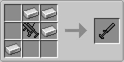

# Type 18 Grenade Launcher

Type 18 Grenade Launcher（18式擲弾銃mod／ひとはちしき　てきだんじゅう　もっど）は、マインクラフトの世界に擲弾銃（グレネードランチャー）とその弾薬を追加するmodです。

## 前提mod

- Minecraft Forge 1.12.2-14.23.5.2768 以降

## ダウンロード

- [v1.12.2-1.1.1.1 (Type18GrenadeLauncher-1.12-2-1.1.1.1.jar)](https://github.com/Iunius118/Type18GrenadeLauncher/releases/download/v1.12.2-1.1.1.1/Type18GrenadeLauncher-1.12-2-1.1.1.1.jar)

## 説明

### 擲弾発射器（グレネードランチャー）

#### 40mmてき弾銃 (40 mm Grenade Launcher)

小型で軽量なグレネードランチャー。標準的な40x46mmグレネード弾を発射することができる。装弾数は1なので発射するごとにリロード時間が発生する。

- **クラフト：** 鉄格子×2 + 鉄インゴット×3 + レバー → 40mmてき弾銃
- **弾薬：** 40mmりゅう弾
- **発射：** 右クリック
- **初速：** 60m/s
- **発射速度：** 7.5発/分

#### 40mm回転式てき弾銃 (40 mm Revolver Grenade Launcher)

6発装填可能な回転式弾倉を持つ（という設定の）グレネードランチャー。40x46mmグレネード弾を6連射することができるが、撃ち尽くした後のリロード時間は長め。

- **クラフト：** 鉄インゴット×8 + 40mmてき弾銃 → 40mm回転式てき弾銃
- **弾薬：** 40mmりゅう弾
- **弾倉：** 6発回転式シリンダー（弾薬は発射時に消費される）
- **発射：** 右クリック
- **初速：** 60m/s
- **発射速度：** 18発/分（平均）、2発/秒（速射）

#### 51mm軽迫撃砲 (51 mm Light Mortar)

1名で運用可能な小口径の迫撃砲。滑腔砲であり安定翼の付いた51mm擲弾を発射することができる。支持架はなく台座を地面に当てた上で手で砲身を保持して仰角を調整する。概ね仰角45度以上の射角においては高い精度を発揮するが、それよりも射角が低い場合は大きく精度が落ちてしまう。発射速度が速いためあらかじめ定めておいた地点に弾幕を張るような運用に向いているが、マインクラフトの世界ならば水平に近い射角で撃つような運用にも耐えうるだろう。

- **クラフト：** 鉄インゴット×4 + 40mmてき弾銃 → 51mm軽迫撃砲
- **弾薬：** 51mmりゅう弾
- **発射：** 地上でスニーク中に右クリック
- **初速：** 60m/s
- **発射速度：** 30発/分

### 弾薬

#### 40mmりゅう弾 (HE 40 mm Grenade Cartridge)

40x46mmサイズのグレネード弾。ライフリングを刻んだ銃身を持つグレネードランチャーから発射される。炸薬を多く内蔵した榴弾で5mの殺傷半径（致死率50%の範囲）を持つ。

- **クラフト：** 重量感圧板（重） + TNT + 火薬 → 40mmりゅう弾×8
- **クラフト：** 51mmりゅう弾 → 40mmりゅう弾×2
- **殺傷半径：** 5m

#### 51mmりゅう弾 (HE 51 mm Grenade Cartridge)

直径51mmの迫撃砲弾。安定翼を持ち口径51mmの滑腔砲から発射される。炸薬の量が40mmりゅう弾よりも圧倒的に多く、高い威力を誇る。

- **クラフト（鉄と砂を節約）：** 40mmりゅう弾 + 火薬 → 51mmりゅう弾
- **クラフト（火薬を節約）：** 40mmりゅう弾×2 → 51mmりゅう弾
- **殺傷半径：** 10m

## 設定

設定は`type18grenadelauncher.cfg`に保存される.

### Client

- **disableRecoil**（真偽値、デフォルトは`false`）
  - てき弾銃のリコイル（発射時の反動）を無効にする

### Common

- **detonateWhenCannotUpdate**（真偽値、デフォルトは`true`)
  - 凍結チャンクによって更新できなくなった榴弾を自爆させる
- **enableLog**（真偽値、デフォルトは`false`）
  - 榴弾の発射・爆破時にコンソールにログを出力する
- **grenadeDamageLevel**（整数値0～2、デフォルトは`1`)
  - 榴弾が破壊可能な対象を数字で指定する（0：なし、1：エンティティのみ、2：地形とエンティティ）

---
Copyright (c) 2019 Iunius118
