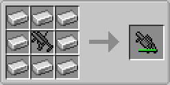

# Type 18 Grenade Launcher

Type 18 Grenade Launcher（<ruby>18式擲弾銃mod<rp>／</rp><rt>ひとはちしき　てきだんじゅう　もっど</rt></ruby>）は、マインクラフトの世界に擲弾発射器（グレネードランチャー）とその弾薬を追加するmodです。

※このmodで追加される兵器はすべてフィクションです。実在する兵器やその仕様とは一切関係ありません。

## 前提mod

- Minecraft Forge 1.12.2-14.23.5.2768 以降

## ダウンロード

- [v1.12.2-1.1.1.1 (Type18GrenadeLauncher-1.12-2-1.1.1.1.jar)](https://github.com/Iunius118/Type18GrenadeLauncher/releases/download/v1.12.2-1.1.1.1/Type18GrenadeLauncher-1.12-2-1.1.1.1.jar)

## 説明

### 擲弾発射器（グレネードランチャー）

#### 40mmてき弾銃 (40 mm Grenade Launcher)

>小型で軽量なグレネードランチャー。40x46mmグレネードを発射することができる。装弾数は1で発射毎にリロード時間が発生する。

- **クラフト：** 鉄格子×2 + 鉄インゴット×3 + レバー → 40mmてき弾銃
- **弾薬：** 40mmりゅう弾
- **発射：** 右クリック
- **初速：** 60m/s
- **発射速度：** 7.5発/分

#### 40mm回転式てき弾銃 (40 mm Revolver Grenade Launcher)

>グレネードを6発装填可能な回転式弾倉を持つ（という設定の）グレネードランチャー。40x46mmグレネードを6連射することができるが、撃ち尽くした後のリロード時間は長め。

- **クラフト：** 鉄インゴット×8 + 40mmてき弾銃 → 40mm回転式てき弾銃
- **弾薬：** 40mmりゅう弾
- **弾倉：** 6発、回転式シリンダー（弾薬アイテムは発射時に消費される）
- **発射：** 右クリック
- **初速：** 60m/s
- **発射速度：** 18発/分（平均）、2発/秒（速射）

#### 51mm軽迫撃砲 (51 mm Light Mortar)

>1名で運用可能な小口径の迫撃砲。安定翼の付いた51mmグレネードを発射することができる滑腔砲。支持架はなく台座を地面に当てた上で砲身を手で保持して仰角を調整する。概ね仰角45°以上の射角においては高い精度を発揮するが、射角がそれよりも低い（概ね仰角36°未満）の場合は精度が大きく落ちてしまう。発射速度が速いため、あらかじめ定めておいた地点へ弾幕を張るような運用に向いている。しかしマインクラフトの世界ならば水平に近い射角で撃つような運用にも耐えうるだろう。

- **クラフト：** 鉄インゴット×4 + 40mmてき弾銃 → 51mm軽迫撃砲
- **弾薬：** 51mmりゅう弾
- **発射：** 地上でスニーク中に右クリック
- **初速：** 60m/s
- **発射速度：** 30発/分

### 弾薬

#### 40mmりゅう弾 (HE 40 mm Grenade Cartridge)

>40x46mmのグレネード。ライフリングが刻まれた銃身を持つグレネードランチャーから発射される。炸薬を多く内蔵した榴弾で5mの殺傷半径（致死率50%の範囲）を持つ。

- **クラフト：** 重量感圧板（重） + TNT + 火薬 → 40mmりゅう弾×8
- **クラフト：** 51mmりゅう弾 → 40mmりゅう弾×2
- **殺傷半径：** 5m

#### 51mmりゅう弾 (HE 51 mm Grenade Cartridge)

>直径51mmのグレネード（迫撃砲弾）。安定翼を持ち口径51mmの滑腔砲から発射される。炸薬の量が40mmりゅう弾よりも圧倒的に多く、高い威力を誇る。

- **クラフト（鉄と砂を節約）：** 40mmりゅう弾 + 火薬 → 51mmりゅう弾
- **クラフト（火薬を節約）：** 40mmりゅう弾×2 → 51mmりゅう弾
- **殺傷半径：** 10m

## 設定

設定は`type18grenadelauncher.cfg`に保存される.

### Client

- **disableRecoil**（真偽値、デフォルトは`false`）
  - てき弾銃のリコイル（発射時の反動）を無効にする（`false`：リコイルあり、`true`：リコイルなし）

### Common

- **detonateWhenCannotUpdate**（真偽値、デフォルトは`true`)
  - 凍結チャンクによって更新できなくなった榴弾を自爆させる（`true`：自爆する、`false`：自爆しない）
- **enableLog**（真偽値、デフォルトは`false`）
  - 榴弾の発射・爆破時にコンソールにログを出力する（`false`：出力しない、`true`：出力する）
- **grenadeDamageLevel**（整数値0～2、デフォルトは`1`)
  - 榴弾が破壊可能な対象を数字で指定する（`0`：なし、`1`：エンティティのみ、`2`：地形とエンティティ）

---
Copyright (c) 2019 Iunius118
